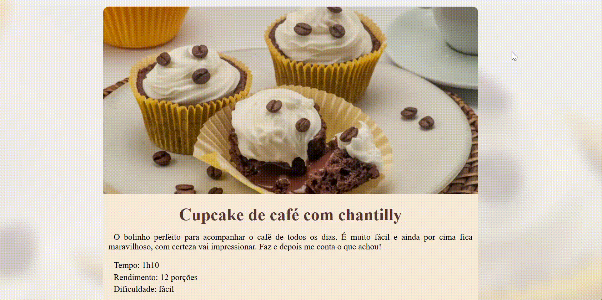

# 🧁 Cupcake de Café com Chantilly

Bem-vindo ao projeto **Cupcake de Café com Chantilly**! Este projeto foi desenvolvido durante o curso **Formação Full-Stack** da [Rocketseat](https://rocketseat.com.br). Ele apresenta uma página responsiva feita no formato **mobile-first**, que detalha uma receita deliciosa de cupcakes com café e chantilly.

## 🌟 Visão Geral

Este projeto é uma página de receita totalmente estilizada, focada em oferecer uma experiência agradável e intuitiva para o usuário, com um design limpo e elegante. A abordagem **mobile-first** garante que o layout seja funcional em dispositivos móveis e escalável para telas maiores, como tablets e desktops.

## 🚀 Tecnologias Utilizadas

-  : Estrutura semântica do conteúdo.
-  : Estilização com foco em design responsivo.
- ``Mobile-First``: Construção da interface priorizando dispositivos móveis.
- ``Media Queries``: Adaptabilidade para diferentes tamanhos de tela.
-  : Fontes estilizadas para melhorar a estética do projeto.
## 📄 Funcionalidades

- **Design Responsivo**: Adaptado para diferentes dispositivos (mobile, tablet e desktop).
- **Conteúdo Semântico**: Estrutura clara e de fácil leitura.
- **Seções**:
  - **Sobre**: Uma introdução à receita.
  - **Ingredientes**: Lista detalhada de itens necessários.
  - **Modo de Preparo**: Instruções claras para fazer o cupcake.

## 📸 Prévia do Projeto



### 🌐 [Acesse o Projeto Online](https://brunotxrs.github.io/projeto-receitas-full-stak/)

## 🛠️ Estrutura de Arquivos
 ```bash
Cupcake-Receita/
├── src/
│   ├── css/
│   │   ├── style.css
│   │   ├── reset-and-global.css
│   │   ├── main.css
│   │   └── footer.css
│   ├── favicon/
│   │   └── favicon.ico
│   └── img/
│       ├── bg-image.jpg
│       ├── img-receita.gif
│       └── main-image.jpg
├── index.html
├── LICENSE
└── README.md
```

## 🎨 Design Responsivo

O layout do projeto foi planejado para se adaptar a diferentes resoluções de tela, utilizando **media queries** para oferecer uma experiência fluida:

- **Mobile (até 667px)**: Interface compacta e funcional.
- **Tablet (668px a 1024px)**: Ajustes no tamanho de fontes e espaçamento.
- **Desktop (acima de 1024px)**: Aproveitamento completo do espaço em telas grandes.

## 📚 Referência de Estudos

Este projeto foi desenvolvido durante a formação **Full-Stack** da [Rocketseat](https://rocketseat.com.br). O curso oferece uma base sólida para o desenvolvimento web, abordando conceitos modernos de frontend e boas práticas no mercado.

## 📜 Licença

Este projeto está licenciado sob a licença **MIT**. Consulte o arquivo [LICENSE](LICENSE) para mais detalhes.

---

💻 **Desenvolvido com ♥ por [Bruno Teixeira](https://github.com/brunotxrs).**  
Sinta-se à vontade para contribuir ou deixar sugestões! 😊